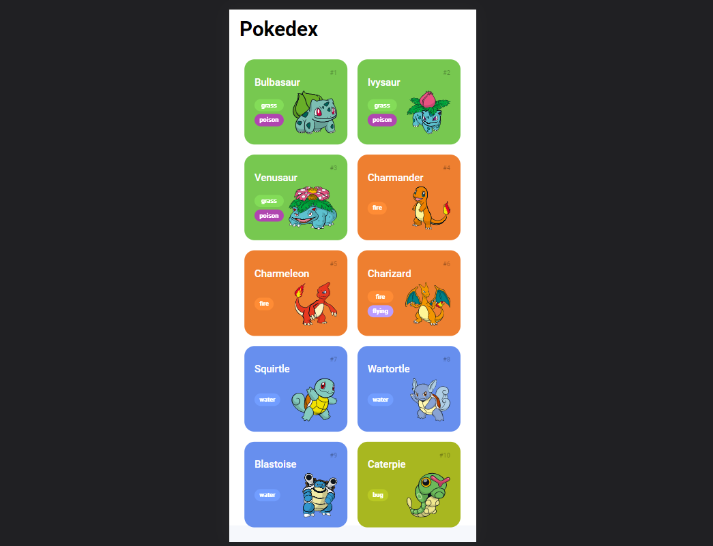
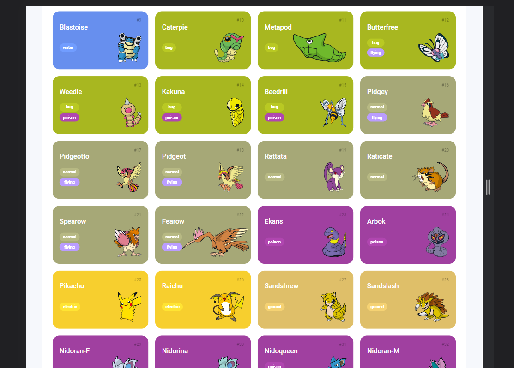

<h1><strong>Pokedéx Developer w/ JS</strong> </h1>
 

  
    

## 🚀 Tecnologias

Esse projeto foi desenvolvido com as seguintes tecnologias:

- HTML e CSS
- JavaScript e JSON
- [Node e NPM](https://nodejs.org/)

## 💻 Projeto

Essa Pokedéx foi desenvolvida ao longo do tópico de "Páginas Interativas com Javascrip", do curso NTT Data - Diversidade em Tech (DIO).
